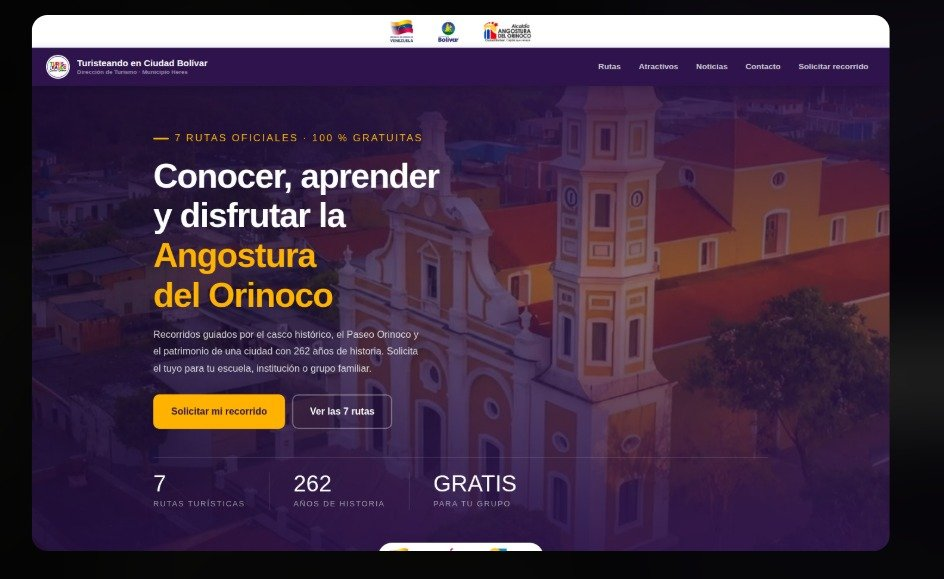
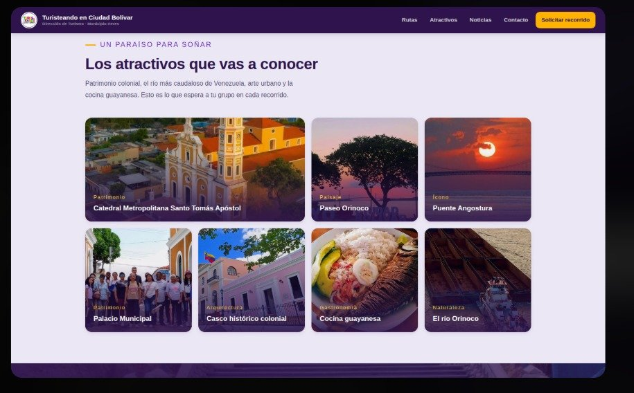
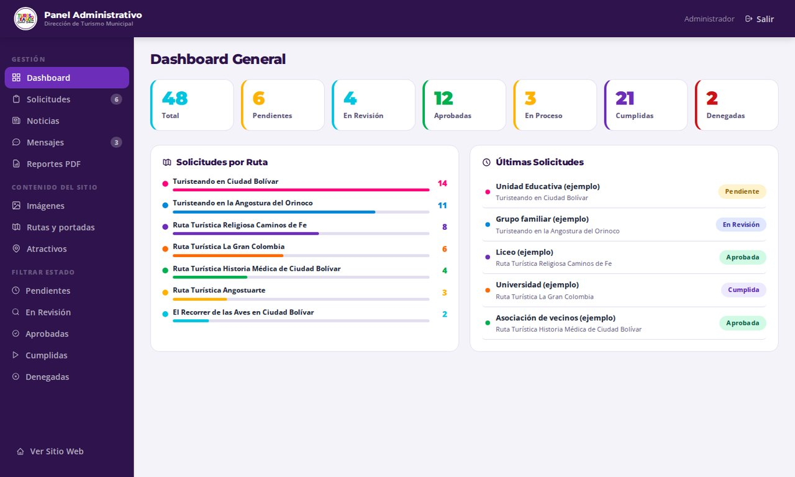
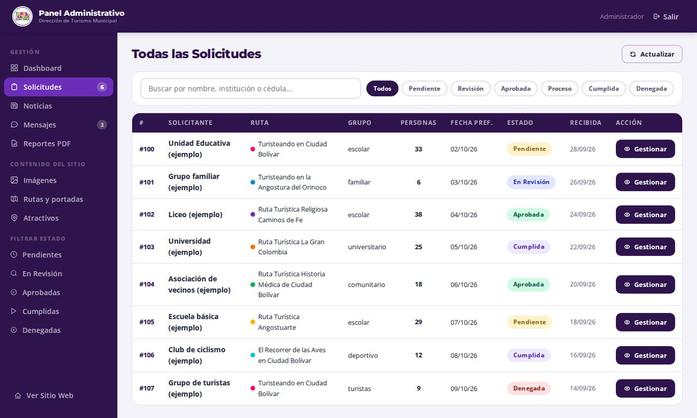
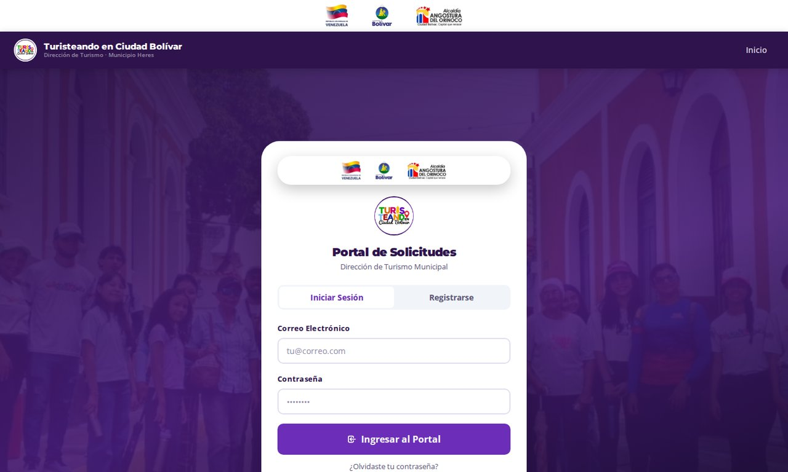
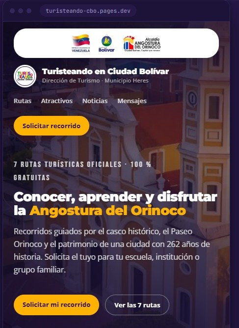
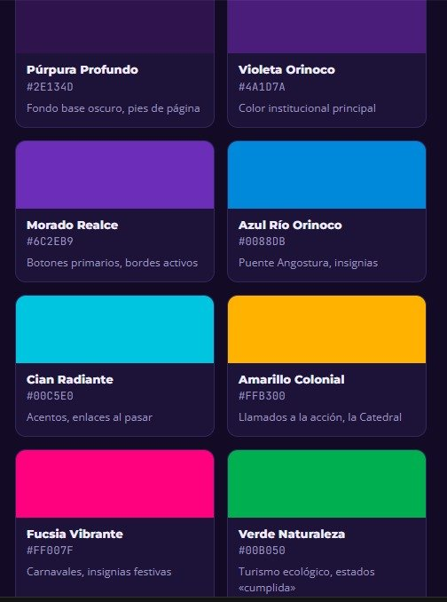
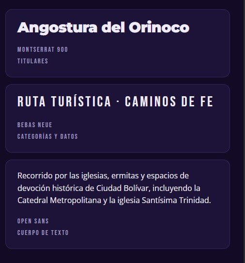

# 🌄 Turisteando en Ciudad Bolívar — Sistema de recorridos turísticos

Plataforma web **full-stack** para la Dirección de Turismo Municipal de Angostura del Orinoco (Ciudad Bolívar, Venezuela). Los visitantes conocen las 7 rutas turísticas oficiales y **solicitan recorridos guiados gratuitos en línea**; la Dirección los gestiona desde un panel administrativo con mensajería, contenidos e imágenes.

🔗 **En producción:** [turisteando-app.pages.dev](https://turisteando-app.pages.dev)


---

## 📸 Capturas

<p align="center">
  
  
</p>
<p align="center">
  
  
</p>
<p align="center">
  
  
</p>

<details>
<summary>🎨 Identidad visual (paleta y tipografía)</summary>
<p align="center">
  
  
</p>
</details>

<sub>Las capturas del panel administrativo usan datos de ejemplo.</sub>

---

## ✨ Qué hace

**Sitio público** (`index.html`)
- Portada, las 7 rutas del casco histórico, atractivos y noticias, todo cargado desde la API.
- Proceso de solicitud en 4 pasos: registro → solicitud → confirmación → recorrido.

**Portal del solicitante** (`portal.html`)
- Registro de personas o instituciones, inicio de sesión y perfil.
- Crear y seguir solicitudes de recorrido (estado, fecha confirmada, guía asignado).
- **Mensajería** con la Dirección dentro de cada solicitud, con adjuntos de imagen.
- Recuperación de contraseña por pregunta de seguridad y cambio obligatorio de contraseña temporal.

**Panel administrativo** (`admin.html`)
- Dashboard con indicadores y reportes.
- Gestión de solicitudes: aprobar, reprogramar, asignar contacto y fecha.
- Bandeja de conversaciones con los solicitantes.
- CMS de **rutas, atractivos y noticias**.
- Biblioteca de imágenes con subida a **Cloudflare R2**.

## 🧱 Arquitectura

```
Navegador ──► Cloudflare Pages (HTML/CSS/JS estático)
                 │
                 └─► Pages Functions  /api/*  (serverless, JavaScript)
                        ├─► PostgreSQL en Neon  (@neondatabase/serverless)
                        └─► Cloudflare R2       (imágenes, servidas en /media/<clave>)
```

- **API REST** con 22 módulos de endpoints en `functions/api/` (públicos, de solicitante y `admin/*`).
- **Autenticación propia**: contraseñas con **PBKDF2-SHA256** (100.000 iteraciones y *salt* aleatorio), tokens de sesión de 256 bits guardados en base de datos con expiración, roles `solicitante` / `admin`.
- **Consultas parametrizadas** (tagged templates de Neon) para evitar inyección SQL.
- Esquema relacional de 9 tablas (`sql/01-esquema-completo.sql`) y migración que conserva los datos (`sql/02-migracion.sql`).
- Imágenes de respaldo en `img/fotos/`: si un contenido todavía no tiene foto, nunca queda un hueco.

```
index.html · portal.html · admin.html     Interfaz (sin frameworks)
css/main.css                             Paleta y tipografía del manual de identidad
functions/_shared/utils.js               BD, hash, sesiones, respuestas JSON
functions/api/                           Endpoints REST
functions/media/[[clave]].js             Entrega de imágenes desde R2
sql/                                     Esquema y migraciones
wrangler.toml                            Configuración de Cloudflare
```

## 🚀 Ejecutar en local

Requisitos: Node 18+, una base de datos gratis en [neon.tech](https://neon.tech) y una cuenta de Cloudflare.

```bash
npm install
cp .dev.vars.ejemplo .dev.vars      # pon tu DATABASE_URL, SEED_SECRET y ADMIN_PASSWORD_INICIAL
# ejecuta sql/01-esquema-completo.sql en la consola SQL de Neon
npm run dev                         # http://localhost:8788
```

Crea el primer administrador abriendo una vez `http://localhost:8788/api/admin/seed?secret=TU_SEED_SECRET`.

## 🌐 Publicar

```bash
npx wrangler login
npx wrangler r2 bucket create turisteando-media
npm run deploy
```

En Cloudflare Pages → *Settings → Variables* agrega `DATABASE_URL` (cifrada) y enlaza el bucket R2 con el nombre `MEDIA`.

> 🔐 Ninguna credencial está en el código: todo va en variables de entorno y `.dev.vars` está en `.gitignore`.

## 👤 Autor

**Dominic De Freitas** — [GitHub](https://github.com/dominic0285) · [LinkedIn](https://www.linkedin.com/in/dominic-de-freitas-07102828a/)

Logos y material institucional pertenecen a sus respectivas instituciones y se incluyen solo porque forman parte del sitio publicado.
